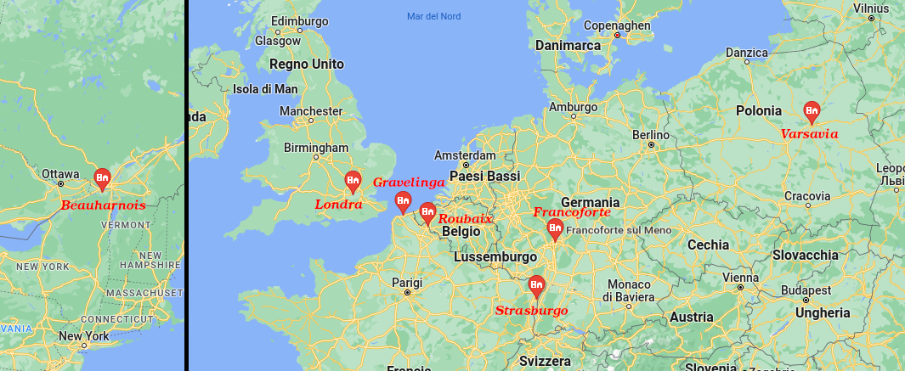

```{r setup, include=FALSE}
knitr::opts_chunk$set(echo = FALSE, fig.align = 'center')#, section_divs = FALSE)
# esplorare cached=TRUE, e mettere cached=FALSE se necessario
library(jsonlite)
library(dplyr)
library(tidyr)
library(ggplot2)
library(stringr)
library(viridis)
library(r2r)
```

```{r data import, include=FALSE, eval=FALSE}
raw_file_path = "./ovh_server_all.txt"

# leggo il file che contiene il dataset e lo separo in data e dati json
all_data = scan(file = raw_file_path, 
                what = list(timestamp = character(0), json_data = character(0)),
                sep = "|",
                quote = NULL
)

# creo un data frame per poterci operare dopo
all_data = data.frame(timestamp = all_data$timestamp, 
                      eta = all_data$json_data
)


# converto le stringhe nei tipi corretti, datetime e nested json
all_data = mutate(all_data,
                  timestamp = as.POSIXct(strptime(timestamp, "%Y-%m-%dT%H:%M:%S%z")),
                  eta = lapply(eta, jsonlite::fromJSON)
)
```

```{r data preparation 1, include=FALSE, eval=FALSE}
# estraggo i dati innestati creando un dataframe con le colonne
# timestamp, fqn, datacenter, eta
             
# rimuovo le colonne inutili, tenendo solo il nome del server (fqn) e le informazioni sulla disponibilità nei datacenter
all_data$eta = lapply(all_data$eta, select, fqn, datacenters, ram, storage, storage_type)

# spacchetto il dataframe "catacenters"
all_data$eta = lapply(all_data$eta, unnest, cols = c(datacenters))

# converto il campo eta di ogni riga in un dataframe
all_data$eta = lapply(all_data$eta, data.frame)

# spacchetto la colonna "eta"
all_data = unnest(all_data, cols = c(eta))

# rinomino la colonna
all_data$eta = all_data$availability
all_data$availability = NULL
```

```{r data save 1, include=FALSE, eval=FALSE}
# Salvo i dati processati fino a qui per poterli ricaricare già elaborati, senza doverli rielaborare
save(all_data, file = "./all_data.Rda")
```

```{r data load 1, include=FALSE, eval=FALSE}
# Ricarico i dati 
load(file = "./all_data.Rda")
```

```{r constant definitions, include=FALSE}
# definisco varie costanti utili per il processing
COLORS = c("red", "blue", "yellow", "green", "pink", "lightblue", "violet")
ORIG_ETA_LEVELS = c("1H-low", "1H-high", "24H", "72H", "240H", "480H", "unavailable")
ETA_LEVELS = c("0.25H", "1H", "24H", "72H", "240H", "480H", "unavailable")
DC_SHORTS = c("gra", "rbx", "sbg", "bhs", "fra", "waw", "lon")
DC_CITYES = c("Gravelinga 🇫🇷", "Roubaix 🇫🇷", "Strasburgo 🇫🇷", "Beauharnois 🇨🇦", "Francoforte 🇩🇪", "Varsavia 🇵🇱", "Londra 🇬🇧")

DISK_TYPES_SHORTS = c("hr", "sr", "hsr") 
DISK_TYPES_NAMES = c("Hardware raid", "Software raid", "Hybrid software raid")

# aggiungo una colonna che indichi in modo numerico la disponiblità
etas_num = c(0.25, 1, 24, 72, 240, 480, 1000)
```

```{r data preparation 2, include=FALSE, eval=FALSE}
# nuova colonna il la città e lo stato del datacenter
all_data$datacenter_city = DC_CITYES[match(all_data$datacenter, DC_SHORTS)]
# nuova colonna con lo storage type in versione lunga
all_data$storage_type_long = DISK_TYPES_NAMES[match(all_data$storage_type, DISK_TYPES_SHORTS)]

# rinomino i livelli eta per renderli più chiari
all_data$eta = ETA_LEVELS[match(all_data$eta, ORIG_ETA_LEVELS)]
# creo la versione numerica degli eta
all_data$eta_num = etas_num[match(all_data$eta, ETA_LEVELS)]

# giorno del timestamp
all_data$timestamp_day = as.Date(all_data$timestamp)
# giorno e ora del timestamp
all_data$timestamp_day_h = strftime(all_data$timestamp, "%Y-%m-%dT%H")

# dati aggregati per ora
aggregated_mean_hour = aggregate(list(all_data$timestamp, all_data$eta_num), by = list(all_data$timestamp_day_h, all_data$fqn, all_data$datacenter), mean)
names(aggregated_mean_hour) <- c("timestamp_day", "fqn", "datacenter", "timestamp", "eta_num")

all_data$eta = factor(all_data$eta, levels=ETA_LEVELS)
```

```{r data save 2, include=FALSE, eval=FALSE}
# Salvo i dati processati fino a qui per poterli ricaricare già elaborati, senza doverli rielaborare
save(all_data, aggregated_mean_hour, file = "./all_data2.Rda")
```

```{r data load 2, include=FALSE}
# Ricarico i dati 
load(file = "./all_data2.Rda")
```

# Introduzione

## Introduzione

-   L'analisi riguarda il fornitore di servizi cloud chiamato **OVH**
-   OVH mette a disposizione server fisici che chi vuole può noleggiare
-   I server fisici sono dei computer che il provider dedica interamente ad un cliente, e quindi non possono essere dedicati a più clienti contemporaneamente
-   OVH possiede vari datacenters (grandi edifici dove si alloggiano i server) distribuiti in Europa e America del nord
-   In ogni datacenter OVH mette a disposizione diversi modelli di server
-   Per ogni modello di server e datacenter OVH da informazioni riguardo il tempo stimato di attesa (ETA) per poter noleggiare quel tipo di server

# Domande di partenza

## Che caratteristiche ha il fornitore OVH?

1.  Quale è il datacenter migliore, ovvero che abbia i tempi di attesa più bassi?
2.  Quale è il modello di server che ha i tempi di attesa più bassi? Quali sono?
3.  Le caratteristiche di un server (ram e disco) influenzano la sua disponibilità?
4.  C'è correlazione tra le ETA di uno stesso modello di server in datacenters diversi? 

# Overview del dataset

## Il dataset

-   Raccolto da me personalmente
-   È composto da record che contengono 4 informazioni principali
    -   La data della misurazione
    -   Il datacenter
    -   Il modello di server
    -   Il tempo stimato di attesa (ETA)
-   Inoltre contiene altri dati, come:
    -   Le caratteristiche del server: quantità di RAM, tipo e dimensione dei dischi, etc
    -   La posizione del datacenter: in quale città e stato si trova

```{r calc metadata, include=TRUE}
# calcolo i metadati sul dataset
first_record = min(all_data$timestamp)
last_record = max(all_data$timestamp)
datacenters_cities = unique(all_data$datacenter_city)
server_configurations = unique(all_data$fqn)
all_etas = unique(all_data$eta)
```

## Il dataset (qualche dato)

-   I dati analizzati coprono l'intervallo dal **`r strftime(first_record, "%d/%m/%Y")`** al **`r strftime(last_record, "%d/%m/%Y")`**, ovvero **`r round((last_record - first_record) / 30)`** mesi di dati
-   I datacenters sono **`r length(datacenters_cities)`** e si trovano a `r datacenters_cities`
-   Le configurazioni server sono **`r length(server_configurations)`** e hanno il nome composto dalle loro caratteristiche, ad esempio `32-sr-2x960nv` indica `32` gb di ram, `sr` indica software raid e `2x960nv` indica 2 dischi da 960 GB l'uno di tipo NVMe.
-   I tempi di attesa previsti (ETA) sono **`r length(all_etas)`** e sono: `r ETA_LEVELS`

## Collocazione dei datacenters

```{r echo=FALSE, out.width='100%'}

```

# Analisi {.small-header-2}

## Prima domanda {.build}

### Quale è il datacenter migliore, ovvero che abbia i tempi di attesa più bassi?

```{r question 1, include=TRUE}

# calcolo il numero di volte che ho registrato un valore per ogni DC ed eta
dc_eta_count = aggregate(
  list(all_data$eta), 
  by = list(all_data$datacenter_city, all_data$eta), 
  length
)
names(dc_eta_count) <- c("datacenter_city", "eta", "count")

# riordino i server in base all'eta
# l'ordine è specifico in base ai dati, per generare un grafico più chiaro
dc_eta_count$eta = factor(dc_eta_count$eta, levels=c("72H", "24H", "1H", "0.25H", "240H", "480H", "unavailable"))
dc_eta_count = dc_eta_count[with(dc_eta_count, order(eta, count)), ]
all_data$datacenter_city = factor(all_data$datacenter_city, levels=unique(dc_eta_count$datacenter_city))

ggplot(all_data, aes(x = datacenter_city,  fill = eta)) +
  geom_bar(position = position_dodge(preserve = "single")) +
  labs(x = "Datacenter", y = "Numero di misurazioni", title = "ETA per Datacenter", fill = "ETA") +
  theme_bw() +
  theme(axis.text.x = element_text(angle = 45, vjust = 0.9, hjust=1))
  
```

Notiamo che:

-   I DC francesi tendono ad avere un tempo minore di attesa (1 giorno) rispetto agli altri (3 giorni). L'unica eccezione è il DC canadese che è il linea con quelli francesi.
-   Conviene quindi scegliere un datacenter francese o canadese, che sono tra di loro simili

## Seconda domanda {.build}

### Quale è il modello di server che ha i tempi di attesa più bassi? Quali sono?

```{r question 2, include=TRUE, fig.height = 6, fig.width = 8}
# calcolo il numero di volte che ho registrato un valore per ogni fqn ed eta
fqn_eta_count = aggregate(
  list(all_data$eta), 
  by = list(all_data$fqn, all_data$eta), 
  length
)
names(fqn_eta_count) <- c("fqn", "eta", "count")


# riordino i server in base all'eta
# l'ordine è specifico in base ai dati, per generare un grafico più chiaro
fqn_eta_count$eta = factor(fqn_eta_count$eta, levels=c("unavailable", "72H", "24H", "1H", "0.25H", "240H", "480H"))
fqn_eta_count = fqn_eta_count[with(fqn_eta_count, order(eta, count)), ]
fqn_eta_count$fqn = factor(fqn_eta_count$fqn, levels=unique(fqn_eta_count$fqn))

# Ripristino l'ordine originale
fqn_eta_count$eta = factor(fqn_eta_count$eta, levels=ETA_LEVELS)

# calcolo la media dell'eta per ogni fqn
fqn_eta_mean = aggregate(
  list(all_data$eta_num), 
  by = list(all_data$fqn), 
  mean
)
names(fqn_eta_mean) <- c("fqn", "mean")

# numero totale dei record per FQN
total_records = sum(fqn_eta_count[fqn_eta_count$fqn == "32-sr-4x1920nv", ]$count) * 1.05

ggplot() +
  geom_col(data = fqn_eta_count, aes(x = fqn, y = count, fill = eta)) +
  coord_flip() +
  labs(x = "FQN", y = "", title = "ETA per FQN") +
  labs(tag="Media") +
  geom_text(data = fqn_eta_mean, aes(x = fqn, y = total_records, label = round(mean, 2)), size=2.5) + 
  theme_bw() +
  theme(legend.box.margin=margin(l=5),
        plot.tag=element_text(angle=-90),
        plot.tag.position=c(.85, 0.5),
        axis.text.x = element_blank(), 
        axis.ticks.x = element_blank() 
  )

```

Notiamo che:

-   La configurazione con 32 GB di ram, software raid e 2 SSD da 512 Gb l'uno è quella più facilmente disponibile (15 ore in media), seguita dalla stessa configurazione ma con 64 GB di ram
-   È interessante notare che la configurazione più spesso disponbile è anche quella selezionata di default sul pannello di acquisto OVH.
-   I server che fanno uso di Hardware Raid sono spesso non disponibili (approfondiremo in seguito la questione)
-   A parte questi due gruppi, quasi tutti gli altri server hanno disponibilità che oscilla tra 35 e 58 ore

```{r question 3 calculations, include=TRUE}

# calcolo la media dei valori che ho registrato
segmented_eta_mean = aggregate(
     list(all_data$eta_num), 
     by = list(all_data$ram, all_data$storage_type, all_data$storage_type_long, all_data$storage), 
     mean
)
names(segmented_eta_mean) <- c("ram", "storage_type", "storage_type_long", "storage", "eta_num")

# creo i nomi parziali degli FQN
segmented_eta_mean$ram_key = paste(segmented_eta_mean$storage_type, segmented_eta_mean$storage, sep='-')
segmented_eta_mean$storage_key = paste(segmented_eta_mean$ram, segmented_eta_mean$storage_type, sep='-')
segmented_eta_mean$storage_type_key = paste(segmented_eta_mean$ram, segmented_eta_mean$storage, sep='-')

```

## Terza domanda  {.build}

### Le caratteristiche di un server (ram e disco) influenzano la sua disponibilità?

```{r question 3 chart 1, include=TRUE}
ggplot(segmented_eta_mean, aes(x = ram_key, y = eta_num, fill = ram)) +
  geom_col(position = position_dodge(preserve = "single")) +
  labs(x = "Storage e Storage Type", y = "ETA media", title = "Variazioni ETA al variare della RAM", fill = "Ram (GB)") +
  theme_bw() +
  theme(axis.text.x = element_text(angle = 90, vjust = 0.5, hjust=1))
```

Notiamo che:

-   Per il server **sr-2x512nv** la versione con 128 GB di ram ha un tempo di attesa maggiore (50 ore) rispetto alla versione a 32 (15 ore) e 64 GB (18 ore)
-   Nel resto dei casi il tempo di attesa non varia significativamente al variare della quantità di RAM all'interno dello stesso modello

## Terza domanda  {.build}

### Le caratteristiche di un server (ram e disco) influenzano la sua disponibilità?

```{r question 3 chart 2, include=TRUE}
ggplot(segmented_eta_mean, aes(x = storage_key, y = eta_num, fill = storage)) +
  geom_col(position = position_dodge(preserve = "single")) +
  labs(x = "RAM e Storage Type", y = "ETA media", title = "Variazioni ETA al variare dello Storage", fill = "Storage") +
  theme_bw() +
  theme(axis.text.x = element_text(angle = 90, vjust = 0.5, hjust=1)) +
  geom_vline(xintercept = c(0.5, 1.5, 2.5, 3.5, 4.5, 5.5, 6.5, 7.5, 8.5, 9.5), linetype = "dotted")
```

Notiamo che:

-   Il tempo di attesa non varia significativamente al variare della quantità di storage all'interno dello stesso modello

## Terza domanda  {.build}

### Le caratteristiche di un server (ram e disco) influenzano la sua disponibilità?

```{r question 3 chart 3, include=TRUE}
ggplot(segmented_eta_mean, aes(x = storage_type_key, y = eta_num, fill = storage_type_long)) +
  geom_col(position = position_dodge(preserve = "single")) +
  labs(x = "RAM e Storage", y = "ETA media", title = "Variazioni ETA al variare dello Storage Type", fill = "Storage type") +
  theme_bw() +
  theme(axis.text.x = element_text(angle = 90, vjust = 0.5, hjust=1))

```

Notiamo che:

-   Prima abbiamo notato che i server che fanno uso di Hardware Raid non sono disponibili la maggior parte del tempo e quando lo sono hanno tempi di attesa lunghi (72H)
-   Ora vediamo che questo accade indipendentemenete dal tipo di disco usato (4x960 GB SSD o 4x6000 GB HDD sata), quindi è una caratteristica dell'hardware raid.

```{r question 4 part 1, include=FALSE}

# 4. Sono correlati i tempi di attesa di uno stesso modello in datacenters diversi?
#	    1. Data una funzione che misura la correlazione, eseguire il test per ogni modello e coppia di DC (45 * 7 * 7 combinazioni)
#	    TODO: Capire se e come visualizzare tutti i livelli di correlazione un in grafico
#	    HINT: Per visualizzare i dati si può:
#		     - Raggruppare per DC (valutando quindi la correlazione tra DC al posto che tra i singoli modelli), 
#          facendo una media delle correlazioni, e visualizzarlo in una griglia con DC vs DC

#	    HINT: cor(temp_dt$y, temp_dt$z)

#	    HINT: Se il livello di correlazione è basso provare a escludere i dati in cui almeno un DC 
#           ha tempi di attesa minori di 24 ore (ANCHOR_2)

# costruisco i prodotto cartesiano FQN x DC x DC
corr_fqn_dc_dc_base = expand.grid(unique(all_data$fqn), unique(all_data$datacenter), unique(all_data$datacenter) )
names(corr_fqn_dc_dc_base) <- c("fqn", "datacenter1", "datacenter2")

# hashmap per cacheare risultati parziali della computazione
# da 2,5 ore a 20 secondi!! XD 
cc_ris_mem = hashmap()
cc_fqn_mem = hashmap()
cc_fqn_dc_mem = hashmap()

# data un fqn e una coppia di DC, calcola l'indice di correlazione della disponibilità di quel modello nei due DC
calc_correlation <- function(fqn_, dc1, dc2) {
    if (dc1 == dc2) {
      # se i due DC sono uguali la correlazione è sicuramente 1
      return (1.0)
    }

    # cacheo i risultati
    m = cc_ris_mem[[c(fqn_, dc1, dc2)]]
    
    if (!is.null(m)) {
        return(m)
    }
    
    # eta già filtrata
    eta1 = cc_fqn_dc_mem[[c(fqn_, dc1)]]
    
    if (is.null(eta1)) {
          # fqn già filtrato 
          fqn_data = cc_fqn_mem[[fqn_]]
         
          if (is.null(fqn_data)) {
              fqn_data = all_data[all_data$fqn == fqn_,]
              cc_fqn_mem[[fqn_]] = fqn_data
          }
      
          eta1 = fqn_data[fqn_data$datacenter == dc1,]$eta_num
          cc_fqn_dc_mem[[c(fqn_, dc1)]] = eta1
    }
    
    # eta già filtrata
    eta2 = cc_fqn_dc_mem[[c(fqn_, dc2)]]
    
    if (is.null(eta2)) {
          # fqn già filtrato 
          fqn_data = cc_fqn_mem[[fqn_]]
         
          if (is.null(fqn_data)) {
              fqn_data = all_data[all_data$fqn == fqn_,]
              cc_fqn_mem[[fqn_]] = fqn_data
          }
      
          eta2 = fqn_data[fqn_data$datacenter == dc2,]$eta_num
          cc_fqn_dc_mem[[c(fqn_, dc2)]] = eta2
    } 
 
    # allineo le lunghezze
    min_len = min(length(eta1), length(eta2)) 

    data = data.frame(eta1 = eta1[1:min_len], eta2 = eta2[1:min_len])

    # devo usare spearman perchè è adatto ai dati time series
    cor_val = cor(data$eta1, data$eta2, method = "spearman")

    # salvo i nomi dei DC invertiti perchè la chiamata che voglio cachare è al contrario
    cc_ris_mem[[c(fqn_, dc1, dc2)]] = cor_val
    
    return(cor_val)
    
}

# calcolo la correlazione
corr_fqn_dc_dc_base$correlation = mapply(
      calc_correlation, 
      corr_fqn_dc_dc_base$fqn, 
      corr_fqn_dc_dc_base$datacenter1, 
      corr_fqn_dc_dc_base$datacenter2
)

# let's clean after ourselves
cc_ris_mem = NULL
cc_fqn_mem = NULL
cc_fqn_dc_mem = NULL
# for good measure
gc()

# rinomino i datacenters dai nomi interni ai nomi belli
corr_fqn_dc_dc_base$datacenter1 = DC_CITYES[match(corr_fqn_dc_dc_base$datacenter1, DC_SHORTS)]
corr_fqn_dc_dc_base$datacenter2 = DC_CITYES[match(corr_fqn_dc_dc_base$datacenter2, DC_SHORTS)]

```

## Quarta domanda  {.build}

### C'è correlazione tra le ETA di uno stesso modello di server in datacenters diversi?

```{r question 4 part 3, include=TRUE}
# ho scelto degli FQN specifici, che facciano da rappresentanti nella loro categoria

corr_fqn_dc_dc_base_filtered = corr_fqn_dc_dc_base[
    corr_fqn_dc_dc_base$fqn == "128-sr-3x1920nv" | corr_fqn_dc_dc_base$fqn == "128-hr-4x6000sa" | 
    corr_fqn_dc_dc_base$fqn == "128-hr-4x960ssd" | corr_fqn_dc_dc_base$fqn == "32-hr-4x960ssd"
  ,]

# riordiniamo le heatmap
corr_fqn_dc_dc_base_filtered$fqn = factor(corr_fqn_dc_dc_base_filtered$fqn, levels=c("128-sr-3x1920nv", "128-hr-4x6000sa", "128-hr-4x960ssd", "32-hr-4x960ssd"))

ggplot(corr_fqn_dc_dc_base_filtered, aes(x = datacenter1, y = datacenter2, fill = abs(correlation))) +
  geom_tile()  +
  scale_fill_viridis() +
  geom_text(aes(label = round(correlation, 2)), size=3.5) + 
  facet_wrap(~ fqn) +
  labs(x = "DC 1", y = "DC 2", title = "FQN vs DC 1 vs DC 2", fill = "Correlazione") +
  theme(axis.text.x = element_text(angle = 90, vjust = 0.5, hjust=1))
```

Notiamo che:

- Che heatmap di correlazione dei server possono essere suddivisi in 4 gruppi
- La prima heatmap in alto a sinstra che rappresenta la maggior parte dei modelli. Notiamo che non c'è particolare correlazione tra i vari datacenter tranne che per Londra 🇬🇧 e Francoforte 🇩🇪.
- Le altre 3 heatmap rappresentano i modelli con hardware raid, che hanno un andamento molto diverso, composto principalmente da due stati. La correlazione è alta. In due casi i datacenter di Francoforte 🇩🇪 e Gravelinga 🇫🇷 hanno un andamento diverso da tutti gli altri.


## Concludendo

**Quale è il datacenter migliore, ovvero che abbia i tempi di attesa più bassi?**
Conviene scegliere un datacenter tra Gravelinga 🇫🇷, Strasburgo 🇫🇷 o Roubaix 🇫🇷

**Quale è il modello di server che ha i tempi di attesa più bassi? Quali sono?**
Il modello con tempo migliore è `32-sr-2x512nv` con 15 ore di attesa medie

**Le caratteristiche di un server (ram e disco) influenzano la sua disponibilità?**
La quantità di RAM e la quantità di disco non influenzano significativamente il tempo di attesa, mentre il tipo di raid si, con l'hardware raid molto meno disponibile degli altri.

**C'è correlazione tra le ETA di uno stesso modello di server in datacenters diversi?**
Non c'è particolare correlazione, tranne nel caso dei datacenters Londra 🇬🇧 e Francoforte 🇩🇪. Per alcuni modelli che presentano un andamento molto particolare (composto principalmente da due stati) la correlazione è alta.


